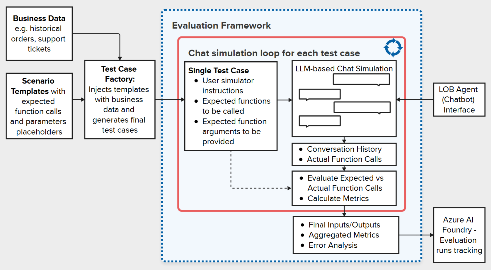

# Line-of-Business Chatbot Evaluation Framework

## The Challenge of Evaluating LOB Chatbots

Evaluating Line-of-Business (LOB) chatbots presents unique challenges that traditional chatbot evaluation methods fail to address adequately:

1. **Function-calling accuracy is paramount** - Unlike general-purpose chatbots where natural language quality is the primary concern, LOB chatbots must accurately invoke business functions with correct parameters to be effective.

1. **Complex business workflows** - LOB chatbots must navigate multi-step business processes while maintaining context across conversation turns.

1. **Deterministic business logic vs. non-deterministic LLM outputs** - While business operations require predictable, consistent outcomes, LLM-powered chatbots produce varying responses to similar inputs.

1. **Domain-specific correctness** - Responses must align with business domain rules and constraints that general linguistic quality metrics cannot measure.

1. **Reliability requirements** - Business applications demand consistent performance across similar scenarios, with minimal variance in function execution.

## Evaluation Framework Architecture



The architecture diagram above illustrates our comprehensive approach to LOB chatbot evaluation. This framework specifically addresses the challenges through a systematic process that focuses on function-calling accuracy and business process adherence.

## Key Components of the Evaluation Framework

### 1. Ground Truth Dataset Management

The foundation of our evaluation framework is a structured ground truth dataset that defines expected chatbot behaviors ([documentation](../../evaluation/chatbot/ground-truth/README.md)):

- **Scenario Templates** – Predefined conversation patterns representing common business workflows stored in [test_scenarios_templates.json](../../evaluation/chatbot/ground-truth/test_scenarios_templates.json)
- **Business Data Integration** – Real business data (support tickets, action items) from CSV files incorporated into test scenarios
- **Expected Function Calls** – Precisely defined function calls with arguments the chatbot should make for each scenario
- **Relationship Preservation** – Maintains business entity relationships (e.g., tickets to action items) during data generation
- **Scalable Generation** – Automated dataset creation using [generate_eval_dataset.py](../../evaluation/chatbot/ground-truth/generate_eval_dataset.py) to produce hundreds of test cases

The ground truth dataset uses a JSON/JSONL format with fields for scenario type, completion conditions, user instructions, and expected function calls with their arguments.

### 2. Evaluation Service

The central orchestrator of the evaluation process ([evaluate.py](../../evaluation/chatbot/evaluate.py)):

- **Test Execution Coordination** – Manages the flow of test scenarios through the evaluation pipeline
- **Evaluator Registration** – Maintains the collection of metric evaluators and their configurations
- **Result Aggregation** – Combines individual test results into comprehensive metrics and reports
- **Output Formatting** – Generates structured evaluation reports in JSON format for analysis
- **Azure Integration** – Optional integration with Azure AI Foundry for tracking evaluation runs and comparing results

The evaluation service loads ground truth data, executes evaluations against the target chatbot, stores results in a standardized format, and automatically executes error analysis notebooks.

### 3. Chatbot Simulator

Simulates realistic user interactions with the chatbot using an LLM-powered User Agent ([chat_simulator.py](../../evaluation/chatbot/simulation/chat_simulator.py)):

- **LLM-based User Simulation** - Uses an LLM to generate natural user inputs based on test scenarios, simulating different user personas and interaction styles
- **Conversation Flow Management** - Handles multi-turn conversations while following scenario instructions and maintaining context
- **Function Call Recording** - Captures all function calls made by the chatbot during testing, including function names and all arguments
- **Termination Strategy** - Automatically detects when conversations are complete based on configurable completion conditions

This component enables systematic testing at scale without requiring human testers, supporting hundreds of test cases efficiently.

### 4. Specialized Evaluators

A collection of focused metric calculators that measure specific aspects of chatbot performance:

- **Function Call Precision Evaluator** (`FunctionCallPrecisionEvaluator`) – Measures if the chatbot calls the right functions without calling unnecessary ones ([function_call_precision.py](../../evaluation/chatbot/evaluators/function_call_precision.py))
- **Function Call Recall Evaluator** (`FunctionCallRecallEvaluator`) – Assesses if all necessary functions are called ([function_call_recall.py](../../evaluation/chatbot/evaluators/function_call_recall.py))
- **Function Call Arguments Precision Evaluator** (`FunctionCallArgsPrecisionEvaluator`) – Evaluates parameter accuracy and checks for unnecessary arguments in function calls ([function_call_precision.py](../../evaluation/chatbot/evaluators/function_call_precision.py))
- **Function Call Arguments Recall Evaluator** (`FunctionCallArgsRecallEvaluator`) – Checks if all required parameters are included in function calls ([function_call_recall.py](../../evaluation/chatbot/evaluators/function_call_recall.py))
- **Function Call Reliability Evaluator** (`FunctionCallReliabilityEvaluator`) – Measures overall success in completing business processes by combining function name and argument recall ([function_call_reliability.py](../../evaluation/chatbot/evaluators/function_call_reliability.py))

Each evaluator produces a score between 0 and 1, with higher scores indicating better performance.

## Key Metrics and Interpretation

The framework provides five core metrics that together give a comprehensive view of chatbot performance:

1. **Function Name Precision** (`Precision_fn`) - Measures if the chatbot calls only the functions it should call (no extra function calls)
1. **Function Name Recall** (`Recall_fn`) - Measures if the chatbot calls all the functions it should call (no missing function calls)
1. **Function Arguments Precision** (`Precision_args`) - Measures if function calls contain only the arguments they should contain (no extra arguments)
1. **Function Arguments Recall** (`Recall_args`) - Measures if function calls contain all the arguments they should contain (no missing arguments)
1. **Reliability Score** (`Reliability`) - Overall measure of task completion success, calculated as the mean of function name recall and argument recall

**Interpretation Guidelines:**

- **High Precision, Low Recall**: Chatbot is conservative but misses required actions
- **Low Precision, High Recall**: Chatbot takes all required actions but also unnecessary ones
- **High Reliability**: Chatbot successfully completes business tasks as intended
- **Target Scores**: Aim for >0.8 on all metrics for production deployment

### 5. Results Analysis & Visualization

Tools for interpreting evaluation results and generating actionable insights:

- **JSON Result Storage** – Detailed metrics stored in machine-readable format for programmatic analysis
- **Aggregation Across Scenarios** – Performance summarized across different business workflows and test scenarios
- **Error Analysis** – LLM-powered identification of patterns in chatbot mistakes and conversation failures ([error_analysis_chatbot.ipynb](../../evaluation/chatbot/error_analysis_chatbot.ipynb))
- **Performance Tracking** – Comparison of metrics across different chatbot versions and configuration changes
- **Azure AI Evaluation SDK Integration** – Leverages Azure's evaluation tools for advanced analysis and optional Azure AI Foundry dashboard integration

This component helps identify specific areas for improvement in the chatbot implementation and provides automated insights from conversation analysis.

## Evaluation Process Flow

1. **Setup Phase**

   - Ground truth datasets are loaded
   - Evaluators are initialized
   - The chatbot target is prepared for testing

1. **Execution Phase**

   - For each test scenario, a simulated conversation occurs
   - The chatbot responds to user inputs and makes function calls
   - All function calls are recorded with their arguments

1. **Evaluation Phase**

   - Actual function calls are compared against expected function calls using sophisticated matching algorithms
   - The matching algorithm compares function names and arguments, while ignoring common utility functions
   - Metrics are calculated for precision, recall, and reliability:
     - **Precision**: Measures accuracy (no unnecessary function calls or arguments)
     - **Recall**: Measures completeness (all required function calls and arguments present)
     - **Reliability**: Overall score combining function name and argument recall

1. **Analysis Phase**

   - Results are aggregated across all test scenarios with statistical summaries
   - Performance patterns are identified using LLM-powered analysis
   - Specific improvement areas are highlighted with actionable recommendations
   - Error analysis notebook is automatically executed to generate insights

## Function Call Matching Algorithm

The evaluation framework uses a sophisticated matching algorithm ([matching.py](../../evaluation/chatbot/evaluators/matching.py)) to compare actual vs expected function calls:

### Matching Strategy

- **Case-Insensitive Function Names**: Function names are compared in lowercase to handle minor variations
- **Ignored Functions**: Common utility functions are automatically filtered out during evaluation:
  - `CommonPlugin-summarize_ticket_details`
  - `CommonPlugin-explain_workflow`
  - `CommonPlugin-start_over`
- **Argument Comparison**: Uses semantic similarity for argument values to handle equivalent but differently expressed values
- **Relationship Preservation**: Maintains proper matching even when function calls appear in different orders

### Matching Process

1. Normalize function names to lowercase
1. Filter out ignored utility functions
1. Match functions by name between actual and expected calls
1. Compare arguments for matched functions using similarity algorithms
1. Track unmatched calls for precision/recall calculations

This approach ensures robust evaluation that focuses on business-critical function calls while being tolerant of minor variations in expression.

## Extending the Framework

The evaluation framework is designed to be extensible:

1. **Custom Evaluators** – Create new evaluators for domain-specific metrics by implementing the [evaluator.py](../../evaluation/chatbot/evaluators/evaluator.py) interface
1. **Test Scenarios Templating** – Easily expand test coverage by adding new [test_scenarios_templates.json](../../evaluation/chatbot/ground-truth/test_scenarios_templates.json)
1. **Custom Error Analysis** – Extend [error_analysis_chatbot.ipynb](../../evaluation/chatbot/error_analysis_chatbot.ipynb) to fulfil your use-case requirements

## Best Practices for LOB Chatbot Evaluation

1. **Regular Evaluation Cycles** - Run evaluations after significant chatbot changes
1. **Comprehensive Scenario Coverage** - Ensure test cases cover all critical business workflows
1. **Balanced Metric Analysis** - Consider all metrics together rather than optimizing for just one
1. **Targeted Improvements** - Focus on functions with lowest precision/recall scores
1. **Iterative Refinement** - Use evaluation results to guide systematic chatbot improvements

## Performance Benchmarks and Expected Score Ranges

Understanding typical score ranges helps set realistic expectations and identify performance issues:

### Baseline Performance Expectations

- **Well-Configured LOB Chatbots**: Should achieve 0.7-0.9 across all metrics
- **Production-Ready Systems**: Target >0.8 on all metrics, especially reliability
- **Development/Testing Phase**: 0.5-0.7 is acceptable for initial iterations

### Common Score Patterns

- **High Precision, Lower Recall (0.9/0.6)**: Conservative chatbot that misses some required actions
- **Lower Precision, High Recall (0.6/0.9)**: Aggressive chatbot that over-executes functions
- **Balanced Performance (0.8/0.8)**: Well-tuned system suitable for production
- **Low Overall Scores (\<0.5)**: Indicates fundamental issues requiring investigation

### Factors Affecting Performance

- **Dataset Quality**: Poor ground truth data leads to misleading evaluation results
- **Function Definition Clarity**: Ambiguous function descriptions reduce chatbot accuracy
- **Prompt Engineering**: Better prompts typically improve precision and recall
- **Model Selection**: More capable LLMs generally achieve higher scores

## Troubleshooting Common Issues

### Low Function Name Precision

**Symptoms**: Chatbot calls unnecessary functions

**Common Causes**:

- Overly broad function descriptions
- Insufficient prompt guidance about when NOT to call functions
- Missing termination conditions in conversation flow

**Solutions**:

- Refine function descriptions to be more specific
- Add negative examples in prompts
- Implement stricter termination logic

### Low Function Name Recall

**Symptoms**: Missing required function calls

**Common Causes**:

- Incomplete business process understanding
- Insufficient context retention across conversation turns
- Conservative prompting that inhibits function calling

**Solutions**:

- Enhance business process documentation
- Improve conversation context management
- Adjust prompts to encourage appropriate function calling

### Low Argument Precision/Recall

**Symptoms**: Incorrect or missing function parameters

**Common Causes**:

- Unclear parameter requirements
- Poor entity extraction from user input
- Type conversion issues

**Solutions**:

- Improve function parameter documentation
- Enhance entity extraction logic
- Add parameter validation

### Evaluation Framework Issues

**Symptoms**: Inconsistent or unexpected evaluation results

**Common Causes**:

- Ground truth data quality issues
- Matching algorithm sensitivity
- Test scenario ambiguity

**Solutions**:

- Review and validate ground truth data
- Adjust matching algorithm parameters
- Clarify test scenario instructions

## Integration with CI/CD Pipelines

### Automated Evaluation Setup

The framework can be integrated into continuous integration workflows:

```bash
# Example CI/CD pipeline step
python -m evaluation.evaluation_service \
  --config evaluation_config.json \
  --output-format json \
  --threshold 0.8
```

### Quality Gates

- **Merge Requirements**: All metrics > 0.7 before code merging
- **Release Criteria**: All metrics > 0.8 for production releases
- **Regression Detection**: Flag >5% metric decrease compared to baseline

### Monitoring and Alerting

- Track metric trends over time
- Alert on significant performance degradation
- Monitor evaluation execution time and resource usage

## Cost Optimization Strategies

### Efficient Evaluation Execution

- **Selective Testing**: Focus on scenarios most likely to reveal issues
- **Staged Evaluation**: Run quick smoke tests before comprehensive evaluation
- **Parallel Execution**: Leverage concurrent test execution where possible

### LLM Cost Management

- **Model Selection**: Balance capability needs with cost considerations
- **Prompt Optimization**: Reduce token usage while maintaining quality
- **Caching**: Reuse evaluation results for unchanged code/data

### Resource Monitoring

- Track evaluation costs by scenario type
- Monitor LLM API usage and optimize accordingly
- Set budget alerts for evaluation spending

## Conclusion

This evaluation framework provides a structured, comprehensive approach to measuring and improving LOB chatbot performance. By focusing on function call accuracy and business process adherence, it enables the development of reliable, effective line-of-business chatbots that deliver consistent value.

For implementation details, see the [evaluation code](../../evaluation/) and for practical examples of running evaluations, refer to the evaluation notebooks in the repository.
